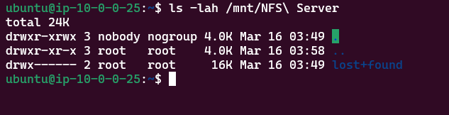

# Project 2 - DIY NAS

### Name: Cody Southworth

## Part 1 - NFS Server Configuration

1. Configure a space, use the `ext4` filesystem
    - Commands used:
        - "sudo sgdisk -n 1:0:0 /dev/xvdf" and "sudo sgdisk -n 1:0:0 /dev/sda"
        - sudo mdadm --create --verbose /dev/md0 --level=0 --raid-devices=2 /dev/xvd[f-g]1
        - sudo mdadm --detail /dev/md0
        - sudo mdadm --detail --scan --verbose | sudo tee -a /etc/mdadm/mdadm.conf
        - sudo mkfs.ext4 -m 0 -E lazy_itable_init=0,lazy_journal_init=0 /dev/md0
        - 
2. `mount` the partition to a folder on your AWS instance.  Allow `other`s to add files / folder and edit files / folders within the folder.
    - Commands used:
        - sudo mkdir /mnt/NFS\ Server
        - sudo mount /dev/md0 /mnt/NFS\ Server
        - df -h
        - sudo blkid
        - sudo chmod o+rw /mnt/NFS\ Server
3. Configure `/etc/fstab` to auto mount the partition to the folder on boot.
    - Line added to `/etc/fstab`:
        - UUID="d686850e-b453-42de-afed-0f8e4ce0cef2 /mnt/NFS\ Server ext4 defaults 0 0
    - Command to test `/etc/fstab`:
        - mount -a
3. Install `nfs` server 
    - Command to install:
        - sudo apt install nfs-kernel-server
    - Command to check service status:
        - service nfs-kernel-server status
4. Configure `/etc/exports` to share folder
    - Line added to `/etc/exports`:
        - "/mnt/NFS Server" 52.5.187.202(rw,sync,no_subtree_check)
    - Describe the options you used in exports and why.  If you used no options, describe all default options that would apply.
5. Enable your `nfs` share
    - Command to export all directories in `/etc/exports`:
        - exportfs -a 
    - Command to restart `nfs`:
        - sudo systemctl restart nfs-kernel-server
6.) Screenshots:
    - 
    - 
    - 

## Part 2 - Firewall Fixes

Screenshot your updated Inbound rules and include it with your documentation

## Part 3 - Mounting an NFS Share

1. Install NFS client
2. Create a directory to mount the NFS share to
3. Mount the share folder using the host's IP (public or private)
4. Prove that you can add files to the `nfs` share
5. Document how to `unmount` the `nfs` share

Screenshot what is currently mounted by `nfs` clients using `nfsstat` and include it with your documentation.

## Extra Credit - WSL2 or Mac as a client (15%)

Why is this extra credit?  WSL2 + Ubuntu can work as an NFS client, but it involves a bit of magic to kick it along.  For extra credit, create a guide for mounting an NFS share to WSL2.  I will award credit if you don't crack it, but do show and document what you tried.  I will award credit if it just works, and again, you document what steps you needed (and maybe provide your version numbers of things for WSL2 and Windows)

`rpc` is what is causing most headaches, and it is mostly acting up because WSL2 is magic and doesn't have true `systemd`

- [SuperUser - rpc-statd is not running](https://superuser.com/questions/657071/mount-nfs-rpc-statd-is-not-running-but-is-required-for-remote-locking)
- [SuperUser - how to mount NFS in WSL2?](https://superuser.com/questions/1667722/how-to-mount-an-nfs-share-on-wsl2)
