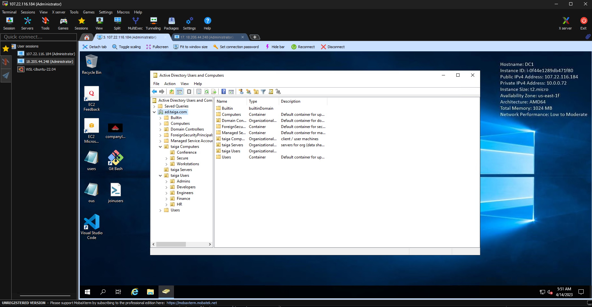

# Project 3

### Name: Cody Southworth

## Setup AD DC

- Configuring a Windows Server to be a Domain Controller
  - EC2:
    - Firstly you need to launch a new Instance. You can give it a name whatever you prefer in my case I named it ```Windows Server 2019```. Next give it an Image and I choose "Windows 2019 Base". Setup your Network Settings to your active running linux instance. Next you need to setup your security group.
    - Once that is all done we now need to give our new instance an elastic IP. Create one and name it however you choose but make sure to assoicate it with your Linux instance. Last thing we need to do is change our inbound settings. Make sure to allow RSD from your home IP and your aws instance IP. 
   - In the System:
      - Our next step is to install Active Directory Domain Services or AD DS for short. To do this we need to open the Windows Powershell and in the terminal put ```Install-WindowsFeature -name AD-Domain-Services -IncludeManagementTools```. This will give you the tools to get the ball rolling.
  - Network Settings:
      - We now need to edit our network settings. Open powershell and enter ```ipconfig /all```. Once you are in the control panel edit your IPv4 settings and take a look at your powershell so you correctly inputting everyting. Change your public IP to the given one in the powershell, change your subnet mask to ```255.255.0.0```. Then change the DNS server to the one listed in powershell. Your machine will need to restart.
  - Computer Name:
    - Next we need to change the PC name. Once again back to the control panel. It is of good habit to name your first domain controller to "DC1". You will need to restart once again to apply the changes.
  - Server Manager:
    - Once in the Server Manager we need to promote this server to a domain controller. Once that is done you will be prompted with a menu to setup the deployment configuration. You will want to add a new forest and give it a root domain name of your choosing. After that just follow through the wizard until it is installed. Your system will need to restart once again. 
- Domain Name: ```ad.taiga.com```
- Domain Controller Name: ```DC1```
- Domain DNS IP: ```10.0.0.2```

---

## AD Structure

### Create OUs
- Screenshot: 

**Extra Credit (5%)** Provide a scripted solution that generates these. There may be a sample `.csv` file in this folder
  * Scripted solution in repo as ```bulkcreate.ps1```

---

### Joining Users
- Screenshot: 

**Extra Credit (5%)** Provide a scripted solution to add users to the OUs given in the OU1 and OU2 column.
  * Scripted solution in repo as ```OU-bulkcreate.ps1```

---

### Joining Computers
[I followed this guide](https://adamtheautomator.com/add-computer-to-domain/)
- Steps:
  - Step 1: Open the System Properties control panel applet
  - Step 2: On the System Properties screen, click the Change button. This button will bring up the Computer Name/Domain Changes dialog box
  - Step 3: In the Computer Name/Domain Changes dialog box, click on the Domain radio option to input a domain to add this computer to
  - Step 4: Input the name of the domain to add the computer to in the Domain box and click OK
  - Step 5: If the computer can contact a domain controller, it will prompt you for a username and password, as shown below. Input a user account with permissions to add this computer to the domain and click OK
  - Step 6: If all goes well, you will receive a message welcoming you to the domain as shown below
- Screenshot: 

---

### Creating Groups

Create the following Security Groups and define where they should be within the OUs based on their roles:

- `project_repos_RW` - users who have Read / Write access to project repositories
    - Placed within: ```"Developers" (OU2) / taiga "taiga Users" (OU1)```
- `finance_RW` - users who have Read / Write access to finance share
    - Placed within: ```"Finance" (OU2) / taiga "taiga Users" (OU1)```
- `onboarding_R` - users who have Read access to onboarding documents
    - Placed within: ```"Admins" (OU2) / taiga "taiga Users" (OU1)```
- `server_access` - users who can log on to Servers
    - ```Placed within "taiga Servers" (OU1)```
- `dev_eng_admins` - IT admins to handle Developer and Engineer accounts
    - Placed within: ```"Admins" (OU2) / taiga "taiga Users" (OU1)```
- `hr_finance_admins` - IT admins to handle HR and finance accounts
    - Placed within: ```"Admins" (OU2) / taiga "taiga Users" (OU1)```
- `remote_workstation` - Group of workstations that allow RDP connections
    - Placed within: ```"Workstations" (OU2) / taiga "taiga Computers" (OU1)```

---

## OUs & GPOs

### Applying Group Policies

Find guides to create the following Group Policy Objects and specify where they should be applied.

- Lock out Workstations after 15 minutes of inactivity
  - [Guide](https://community.spiceworks.com/topic/1416384-gpo-to-lock-the-computer-after-10-minutes-of-inactivity)
  - Placed within: ```"Workstations" (OU2) / "taiga Computers" (OU1)```
- Prevent execution of programs on computers in Secure OU
  - [Guide](https://www.technipages.com/prevent-users-from-running-certain-programs/)
  - Placed within: ```"taiga Secure" (OU1)```
- Disable Guest account login to computers in Secure OU
  - [Guide](https://www.lepide.com/blog/top-10-most-important-group-policy-settings-for-preventing-security-breaches)
  - Placed within: ```"taiga Secure" (OU1)```
- Allow server_access to sign on to Servers
  - [Guide](https://community.spiceworks.com/how_to/2797-restrict-computer-logons-to-a-group-of-users)
  - Placed within: ```"taiga Servers" (OU1)```
- Set Desktop background for Conference computers to company logo
  -  [Guide](https://woshub.com/setting-desktop-wallpapers-background-using-group-policy/)
  -  Placed within: ```"Conference" (OU2) / taiga "Computers" (OU1)```
- Allow users in `remote_workstation` group to RDP to Workstations
  - [Guide](https://learn.microsoft.com/en-us/answers/questions/370650/group-policy-entry-to-allow-remote-administration)
  - Placed within: ```"Workstations" (OU2) / taiga "taiga Computers" (OU1)```

**Extra Credit (5%)** Create and apply one of these policies, and show proof it worked.
Screenshot: 
Screenshot: 

---

### Managing OUs

More people are joining the IT/ administration side of things. Note: you can promote from within or create some new users

Join at least one person to the `hr_finance_admins` and `eng_dev_admins` groups, respectively. Delegate control of the OUs corresponding to the appropriate admin groups.

Document how to delegate control of an OU to a group, which OUs they now delegate, and what permissions they were given (and why you think the scope is appropriate)

- Resources
- https://theitbros.com/active-directory-organizational-unit-ou/
